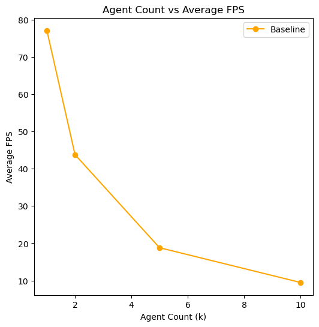
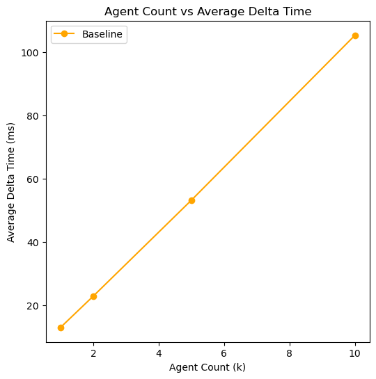
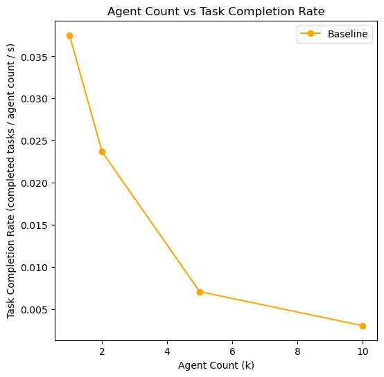
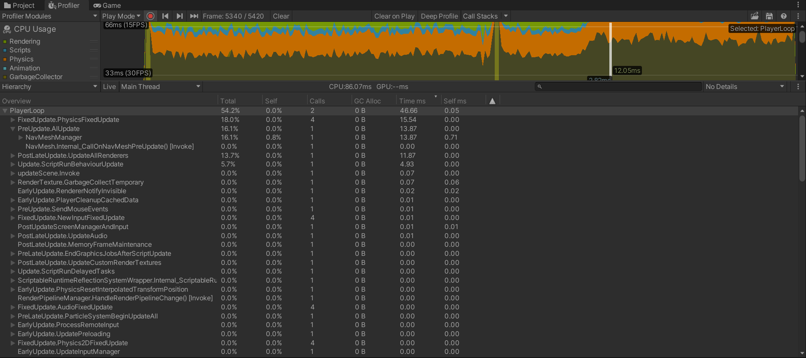

# Scalable Mass Crowd Simulation with Multi-Agent Behavior

## Checkpoint 1

In this checkpoint, we aim to formally define the goals of the project and how we will evaluate the measure of success.

### Goals

As mentioned in the [proposal](../README.md), we aim to build a system to allow for large-scale simulations of autonomous agents navigating and performing simple tasks within a shared game environment. We will be using the Unity game engine with the primary goal is to maximize the number of such agents while maintaining real-time performace (at least 30 FPS). Ultimately, we plan to utilize strategies such as centralized scheduling, spatial partitioning, behavior level-of-detail (LOD), while also implementing CPU multithreading and the Entity Component System through Unity DOTS.

### Project Setup

Before starting our work on creating an optimized system, we first began with creating a naive baseline system. In this system, we define the agent as a Nav Mesh Agent which will attempt to navigate around a simple plane with randomized target positions. This uses Unity's built-in navigation mesh system which avoids other agents along its path. Once an agent reaches its target, a global task completion counter is incremented and a new target is randomly chosen. To measure the performance of the system, we use a combination of the built-in profiler and a custom script for logging metrics such as the number of completed tasks, average delta time between each frame, and average FPS.

### Evalvuation

To compare and evaluate our incremental implementations of strategies, we can perform experiments to analyze the scalability of each system. Below we list the experiments and example graphs that we plan to use. All of the experiments below will be attempting to use an agent performing the same tasks as defined above. To ensure consistency and a fair comparison across different strategies, we will be using the same machine and setup across all of these experiments.

#### Experiments
- **Agent Count vs Delta Time**  
This will be a simple comparison of the scalability of the simulation for each system. A simple plot like below should suffice.

- **Agent Count vs FPS**  
This is the same as the Agent Count vs Delta Time experiment defined above, with just the units of measurement of performance being the recprocal of each other.

- **Agent Count vs Task Completion Rate**  
One of the goals of this project is to also maintain the behavioral quality of each agent as we scale the simulation. Measuring such quality is non-trivial, but we will attempt to estimate this through the task completion rate (in this case, the number of times each agent successfully navigates to its target position). Specifically, we will be measuring the number of tasks completed out of the total number of agents in the simulation across a predefined time period. This effectively gives the task completion fraction across a set time period. An example of such a plot is shown below (using tasks/agentcount/second). 

- **Alterations of the navigation environment**  
We will also perform the experiments defined above with different navigation environments, to see if the environments have an effect on the quality of the simulation. Each environment will have different obstacles that the agnet may need to navigate around.

- **Profiling**  
Unity provides a built-in profiler that allows us to see the distribution of compute time being spent on different parts of the core game logic. We can identify and locate "hot paths" or performance-critical parts of the code, to help guide us for optimization.
