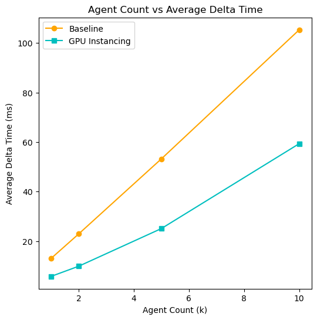
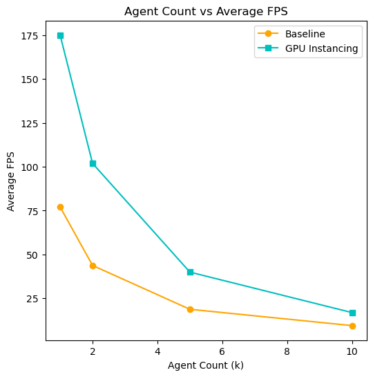
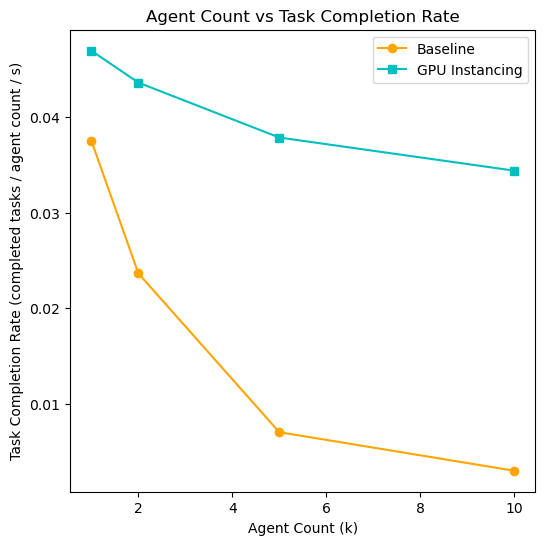

# Scalable Mass Crowd Simulation with Multi-Agent Behavior

## Checkpoint 2

In this checkpoint, we aim to expand upon the first checkpoint by incrementally implementing some optimization methods for improving the performance of the mass agent simulation. We rerun the experiments defined in [checkpoint 1](./checkpoint1.md) to show the comparison of this new system compared to the baseline.

**Code for the simulation system can be found in the Scripts folder [here](../Assets/Scripts/).**  
*(this folder also contains the logging system we used to generate the csv files)*  

**Code for generating the plots can be found in the Python Scripts folder [here](../PythonScripts/).**

### System Implementation

Our first iteration of improving the baseline system focuses on reducing the amount of CPU time spent on the rendering side of the simulation. Specifically, we implement spatial hashing and GPU instancing. This is a common technique used in computer graphics to reduce the number of expensive draw calls to the GPU by batching the many copies of the same mesh into a single draw call. To support an arbitrary number of agents, we partition the space into a grid of cells and issue one instanced draw call per cell (the Unity API has a maximum limit of 1023 instances for each instanced draw call; we may look into using a `ComputeBuffer` and `Graphics.DrawMeshInstancedIndirect` instead for future iterations, and compare the approaches).

This resulted in a much more efficient method for rendering the many agents, though it is limited to rendering copies of a single mesh, as shown by the experiments (defined in [checkpoint 1](./checkpoint1.md)) below.

### Experiments
- **Agent Count vs Delta Time**  

- **Agent Count vs FPS**  

- **Agent Count vs Task Completion Rate**  

These results show a significant improvement in performance over the baseline system for lower agent counts. However, there does seem to be diminishing returns for larger agent counts in terms of FPS. Surprisingly, the task completion rate has significatly increased despite the lack of optimizations for the logical aspect of the agents. This may indicate that the computational load freed up from the rendering side allowed for the fixed updates (Unity decouples rendering from the logical loop as fixed and unfixed update functions) to catch up to its intended rate.

### Next Steps

Currently, our implementation only optimizes the graphical aspect of the simulation. As our next iterations, we intend to implement a behavioral level-of-detail system while utilizing CPU multithreading and the Unity DOTS system (Unity's Entity Component System) for a more efficient, cache friendly approach.